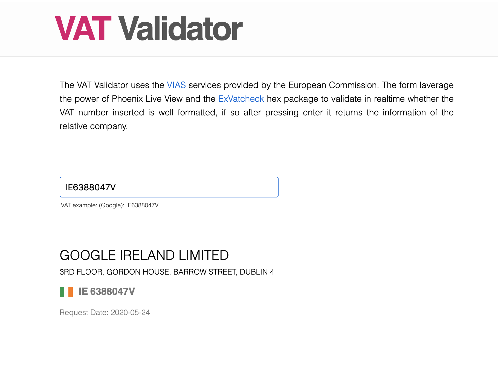

# PhoenixVatChecker

This application uses Phoenix Live View to checks if the VAT number passed is valid, if so it returns the information of the related company.

---

To start PhoenixVatChecker server:

  * Get the dependencies `mix deps.get`
  * Start Phoenix endpoint with `mix phx.server`

Now you can visit [`localhost:4000`](http://localhost:4000) from your browser.

Also you can see the live version here: [`https://evening-headland-09236.herokuapp.com/`](https://evening-headland-09236.herokuapp.com/)

